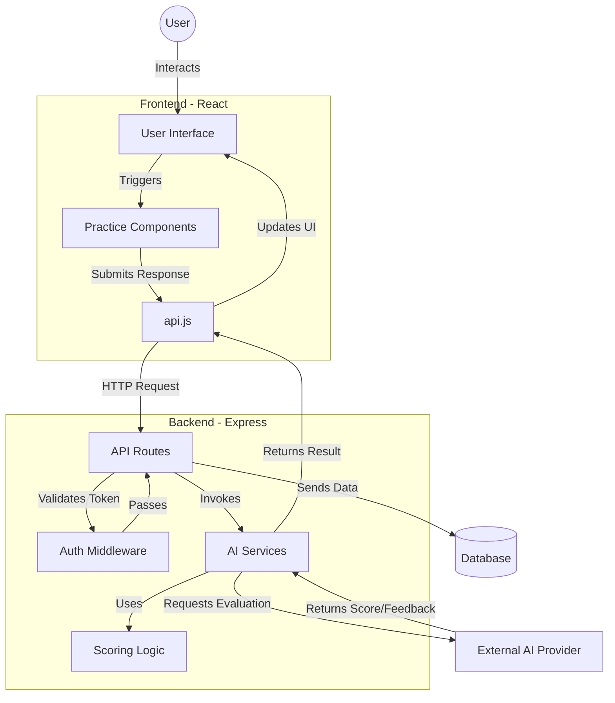

# PTE AI Portal — Complete Full-Stack Starter

A production-oriented PTE preparation portal inspired by the feature set of modern PTE practice platforms, with original UI/code.

## Included

- React + Vite frontend
- Node.js + Express backend
- MongoDB/Mongoose support
- JWT authentication + bcrypt password hashing
- Sign up / sign in / sign out
- Protected dashboard
- Profile
- Practice history
- Reading practice + timer + scoring
- Listening practice + audio player + scoring
- Writing: Summarize Written Text + Essay + feedback
- Speaking: microphone recording, timer, speech recognition where supported, audio upload, AI-style feedback
- Mock test flow
- Personalized study plan
- Admin panel + question management
- Subscription-ready API structure
- Razorpay-ready payment service placeholder
- AI provider integration point with safe fallback scoring
- Error handling and validation
- Responsive UI

## Project Architecture

### Project Structure

```text
pte-ai-portal/
├── client/
│   ├── public/                 # Static assets (e.g., question images)
│   ├── src/
│   │   ├── components/         # Reusable UI components
│   │   ├── pages/              # Main application pages (Admin, Dashboard, etc.)
│   │   ├── practice/           # Practice-specific logic and UI components
│   │   ├── api.js              # API client for server communication
│   │   ├── App.jsx             # Main application component
│   │   └── main.jsx            # Entry point
│   └── index.html              # Main HTML file
└── server/
    ├── src/
    │   ├── middleware/         # Auth/request middleware
    │   ├── models/             # Database schemas
    │   ├── routes/             # API endpoint definitions
    │   ├── scoring/            # Scoring logic
    │   ├── services/           # AI integration (evaluators, prompts)
    │   ├── utils/              # Helper utilities
    │   ├── validation/         # Input validation logic
    │   ├── app.js              # Express app configuration
    │   └── index.js            # Server entry point
    └── uploads/                # File upload directory
```

### Flow Diagram (Detailed)



### Component Breakdown (Detailed)

*   **Frontend (`client/`)**:
    *   **`src/api.js`**: Centralized Axios/Fetch client managing authentication headers and base URL routing.
    *   **`src/practice/`**: Contains sub-folders like `listeningData/` containing question metadata and logic, and UI components (e.g., `Listening.jsx`, `Speaking.jsx`) that render the specific test section.
    *   **`src/practiceTaskRegistry.js`**: Likely acts as a registry to map task types to their respective data and components.

*   **Backend (`server/`)**:
    *   **`src/routes/`**: Handles incoming HTTP requests and directs them to appropriate controllers (e.g., `admin.js`, `questions.js`, `submissions.js`).
    *   **`src/services/ai/`**:
        *   **`evaluator.js`**: Core orchestration for AI-based scoring.
        *   **`prompts.js`**: Defines system and user prompts used to instruct the AI to evaluate PTE responses.
        *   **`validate.js`**: Ensures the raw AI output adheres to the expected JSON structure before the system accepts it.
    *   **`src/scoring/`**:
        *   **`objective.js`**: Performs deterministic scoring for objective questions (multiple choice, fill in the blanks) where the answer key is known.
        *   **`index.js`**: Main entry for scoring logic.

### Summary
The **PTE AI Portal** is a platform for PTE test practice and evaluation. It separates concerns between the React frontend, which provides the user interface, and the Node.js backend, which handles application logic, data storage, and integration with AI models for response scoring.

## Requirements

- Node.js 18+ (Node 20 LTS recommended)
- MongoDB local OR MongoDB Atlas
- Modern Chrome/Edge recommended for microphone and speech recognition

## Start backend

```bash
cd server
copy .env.example .env
npm install
npm run dev
```

## Start frontend

Open another terminal:

```bash
cd client
npm install
npm run dev
```

Frontend: http://localhost:5173
Backend: http://localhost:5000

## Environment

Backend `.env`:

```env
PORT=5000
MONGODB_URI=mongodb://127.0.0.1:27017/pte_ai_portal
JWT_SECRET=change_this_to_a_long_random_secret
CLIENT_URL=http://localhost:5173

# Optional. If omitted, the portal uses deterministic local scoring.
OPENAI_API_KEY=
OPENAI_MODEL=gpt-4.1-mini

# Optional Razorpay configuration
RAZORPAY_KEY_ID=
RAZORPAY_KEY_SECRET=
```

## Demo admin

After registering a normal user, call:

```text
POST /api/auth/bootstrap-admin
```

with the user's JWT in Authorization header. This is intentionally a local-development convenience. Remove/disable it before production.

## Important

The portal's AI score is an **estimated practice score**, not an official Pearson PTE score. For production, use a validated scoring methodology and approved data/content.

Microphone access requires HTTPS in production (localhost works in development).

## Suggested next production work

- Move uploaded audio to S3/Cloudinary
- Add rate limiting and refresh-token rotation
- Add email verification / password reset
- Add real Razorpay orders + webhook verification
- Add real AI provider and speech analysis pipeline
- Add automated tests and CI/CD
- Add Pearson-licensed/authorized content where required
